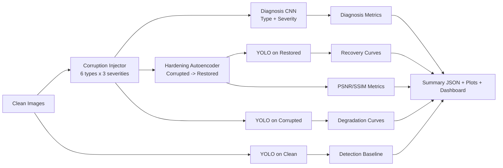
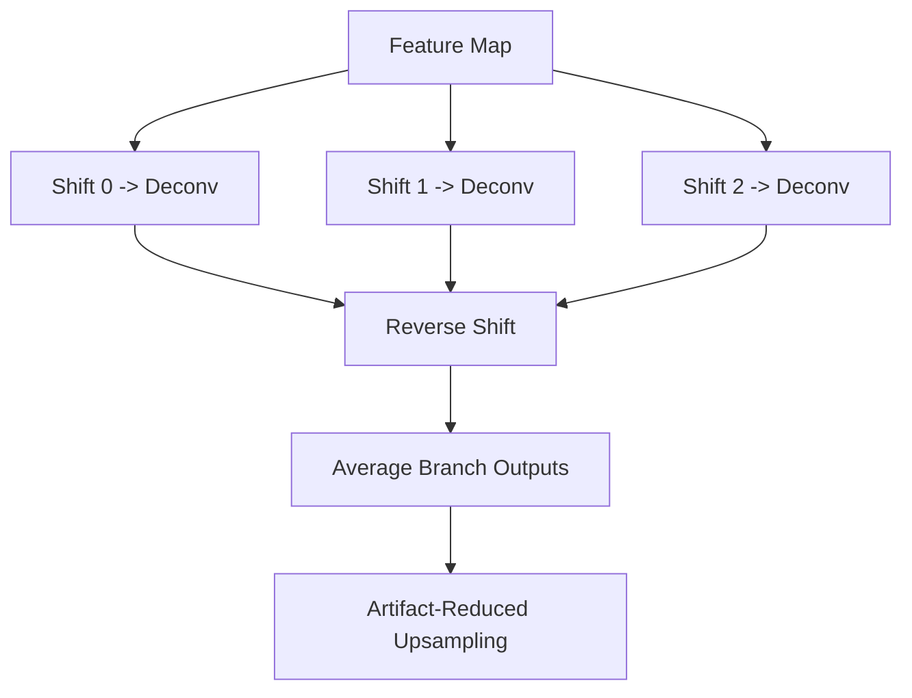
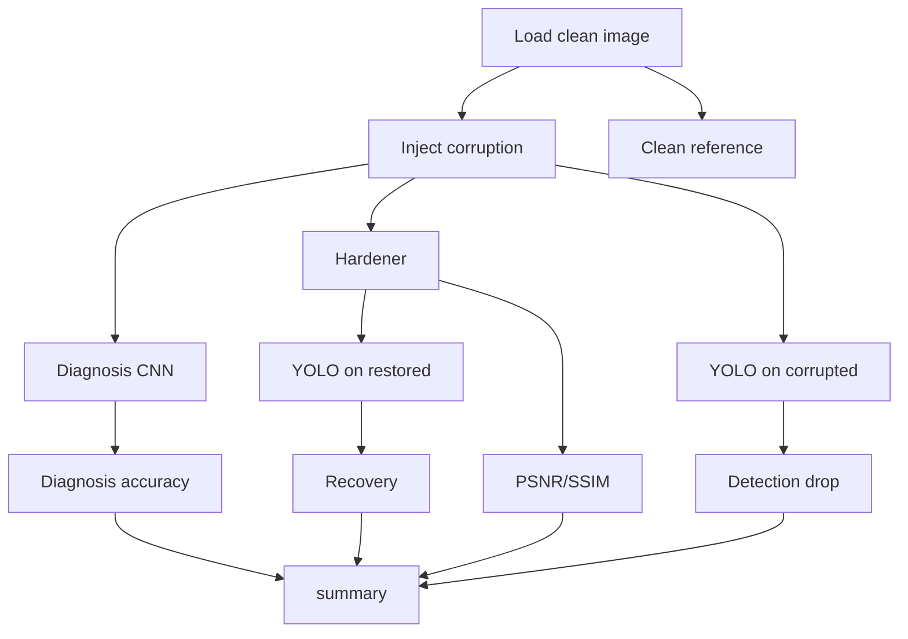

# Project Technical Dossier
## Effect of Data Preprocessing on Machine Learning Models

This document is the authoritative technical reference for the implementation in this repository. It is written for readers who are new to the project but need enough depth to defend design choices during a research presentation or viva.

---

## 1. Executive Overview

### One-line objective
Build and evaluate a complete robustness pipeline that quantifies how preprocessing failures in satellite imagery impact downstream ML behavior, then measure how much a learned hardening model can recover that loss.

### What this system does end-to-end
1. Loads clean satellite images.
2. Injects physically motivated preprocessing failures (6 corruption families x 3 severity levels).
3. Trains a diagnosis model to identify corruption type and severity.
4. Trains a hardening autoencoder to restore corrupted images.
5. Evaluates downstream detection behavior on clean, corrupted, and hardened images.
6. Produces JSON metrics + publication-ready plots + dashboard UI.

### Why this matters in research
Traditional model benchmarks assume ideal input pipelines. Real pipelines are noisy, lossy, and imperfect. This project converts that assumption into a measurable robustness study.

---

## 2. Research Framing and Hypotheses

### Problem statement
Preprocessing failures can create domain shift before inference, reducing reliability even when the model architecture remains unchanged.

### Primary hypotheses
1. Different preprocessing failure modes produce different degradation patterns.
2. A dedicated diagnosis stage can identify failure mode and severity with usable accuracy.
3. A learned restorer can partially recover downstream performance, but recovery is corruption-dependent.

### Scope boundaries
1. Focus is robustness trend analysis, not SOTA leaderboard chasing.
2. Current demonstration uses EuroSAT image structure and YOLO detection counts as stress signals.
3. Metrics should be interpreted as implementation proof and analytical evidence.

---

## 3. Dataset and Data Assumptions

### Dataset used in current experiments
`datasets/eurosat/eurosat/2750`

### Loader behavior
`data/dataset.py` uses recursive image scan (`rglob`) and supports:
- `.png`, `.jpg`, `.jpeg`, `.tif`, `.tiff`

### Important interpretation note
EuroSAT is land-use classification oriented. The downstream detector stage still functions for robustness stress testing, but results should be presented as behavior analysis rather than final detection benchmark claims.

---

## 4. Full System Architecture



---

## 5. Codebase Map (What each module is for)

### Orchestration
- `main.py`: CLI entry point, mode routing, config overrides, pipeline execution.

### Configuration
- `config/config.py`: typed dataclass config for paths, corruption, models, training, detector.

### Corruption modeling
- `corruption/injector.py`: physically motivated corruption generation and benchmark set construction.

### Data handling
- `data/dataset.py`: recursive loaders, train datasets, dataloader factory, dataset adapters.

### Baseline preprocessing model
- `preprocessing/pipeline.py`: conceptual calibration/correction/normalization/tiling steps.

### Models
- `models/diagnosis_cnn.py`: ResNet-based multi-task classifier.
- `models/autoencoder.py`: U-Net style hardener with Kick decoder.
- `models/yolo_evaluator.py`: YOLO wrapper for downstream stress testing.

### Training and evaluation
- `training/train_diagnosis.py`: diagnosis training loop.
- `training/train_autoencoder.py`: hardener training loop.
- `training/evaluate.py`: full benchmark evaluation and summary synthesis.

### Metrics and visualization
- `utils/metrics.py`: PSNR, SSIM, recovery, stress curves.
- `utils/visualization.py`: corruption grids, stress plots, dashboard figure.

### Demonstration UI
- `demo_ui.py`: Streamlit research dashboard.

---

## 6. Corruption Modeling: Logic and Formulas

Corruption IDs and semantic mapping:
1. `0`: clean
2. `1`: atmospheric haze
3. `2`: gaussian blur
4. `3`: jpeg artifacts
5. `4`: sensor noise
6. `5`: radiometric drift
7. `6`: band misalignment

### 6.1 Atmospheric haze
Model:
`I(x) = J(x) * t(x) + A * (1 - t(x))`, where `t(x) = exp(-beta * d(x))`

Interpretation:
Residual atmospheric scattering after imperfect correction.

### 6.2 Gaussian blur
Applies PSF-like blur with severity-dependent sigma.

Interpretation:
Turbulence/optics blur and failed deblurring.

### 6.3 JPEG artifacts
Encode/decode with severity-dependent JPEG quality.

Interpretation:
Transmission/storage compression loss.

### 6.4 Sensor noise
Combined Gaussian + signal-dependent shot-like noise.

Interpretation:
Electronic + photon noise not fully corrected.

### 6.5 Radiometric drift
Per-channel gain/offset perturbation.

Interpretation:
Calibration drift or stale correction constants.

### 6.6 Band misalignment
Sub-pixel channel shift using interpolation.

Interpretation:
Imperfect co-registration across spectral channels.

---

## 7. Diagnosis Model (What and Why)

File: `models/diagnosis_cnn.py`

### Architecture
1. Shared ResNet backbone (feature extractor).
2. Head A: corruption type logits (7 classes).
3. Head B: severity logits (3 classes).

### Loss
`L_total = w_type * CE(type) + w_severity * CE(severity)`

### Why multi-task
Type and severity are correlated but not identical. Shared learning improves representation quality while preserving task-specific outputs.

### Explainability support
Grad-CAM hooks are registered on final conv block to localize failure signatures.

---

## 8. Hardening Model (What and Why)

File: `models/autoencoder.py`

### Architecture
1. U-Net style encoder/decoder with skip connections.
2. Kick upsampling in decoder to reduce checkerboard artifacts.
3. Output head returns restored image in `[0,1]`.

### Kick decoder intuition
Instead of one transposed convolution branch, multiple shifted branches are used and averaged.



### Composite loss
`L = w1 * L1 + w2 * Perceptual + w3 * SSIM_loss`

Why this combination:
1. `L1` keeps pixel fidelity.
2. Perceptual loss preserves semantic/texture features.
3. SSIM term preserves structural relationships.

---

## 9. Downstream Evaluation Logic

File: `training/evaluate.py`

For each `(corruption_type, severity)` pair and each test image:
1. Corrupt image.
2. Diagnose corruption type.
3. Restore using hardener.
4. Run YOLO on corrupted and restored variants.
5. Compute quality + detection metrics.

### Evaluation flow


---

## 10. Metrics: Exact Meaning

### PSNR
Higher means closer pixel-level reconstruction to clean target.

### SSIM
Higher means better structural similarity to clean target.

### Detection Drop %
Relative drop from clean detector count to corrupted count.

### Recovery Rate %
`Recovery = ((Hardened - Corrupted) / (Clean - Corrupted)) * 100`

Interpretation:
1. `100%`: full recovery to clean baseline.
2. `0%`: no recovery.
3. `<0%`: hardening worsened downstream behavior.
4. `>100%`: hardened exceeded clean baseline.

---

## 11. Main Entry Modes (CLI)

File: `main.py`

1. `train_diagnosis`
2. `train_autoencoder`
3. `evaluate`
4. `visualize`
5. `full_pipeline`

Important runtime flags:
- `--image_dir`
- `--image_size`
- `--epochs`
- `--batch_size`
- `--max_images`
- `--num_workers` (Windows stability: use `0`)

---

## 12. Core Pseudocode

### 12.1 Main orchestration
```text
config <- get_config + CLI overrides
set_seed
switch mode:
  train_diagnosis -> train diagnosis model
  train_autoencoder -> train hardener
  evaluate -> run full benchmark
  visualize -> save corruption grids
  full_pipeline -> diagnosis + hardener + evaluate + visualize
```

### 12.2 Diagnosis training
```text
build corruption diagnosis dataset
for epoch:
  forward(type_logits, severity_logits)
  compute combined CE loss
  backprop + clip gradients + optimizer step
  validate and save best checkpoint
```

### 12.3 Hardener training
```text
build (corrupted, clean) pair dataset
for epoch:
  restored <- hardener(corrupted)
  loss <- L1 + Perceptual + SSIM
  backprop + clip gradients + optimizer step
  validate via PSNR/SSIM and save best checkpoint
```

### 12.4 Evaluation summary
```text
for each corruption family and severity:
  collect diagnosis accuracy
  collect restoration quality (PSNR/SSIM)
  collect detection counts (clean/corrupted/hardened)
compute drop and recovery curves
export JSON + plots
```

---

## 13. Output Artifacts and Where to Find Them

1. `outputs/evaluation/results.json` - complete numerical record.
2. `outputs/evaluation/dashboard.png` - consolidated figure.
3. `outputs/evaluation/stress_curves.png` - per-corruption trend curves.
4. `outputs/visualizations/*.png` - corruption sample grids.
5. `checkpoints/diagnosis_cnn/best_model.pt`
6. `checkpoints/autoencoder/best_model.pt`

---

## 14. How to Run (Presentation-safe)

### Fast proof run
```powershell
python main.py --mode full_pipeline --image_dir ./datasets/eurosat/eurosat/2750 --image_size 64 --epochs 1 --batch_size 4 --max_images 10 --num_workers 0
```

### Dashboard
```powershell
streamlit run demo_ui.py --server.port 8503
```

---

## 15. Practical Interpretation of Current Results

Given your existing output:
1. Pipeline is executable and reproducible end-to-end.
2. Diagnosis accuracy varies strongly by corruption family.
3. Restoration quality is moderate and stable.
4. Recovery can be positive/neutral/negative depending on corruption type and severity.

Research takeaway:
Preprocessing effects are structured and non-uniform; robustness must be measured as per-corruption stress curves, not a single aggregate number.

---

## 16. Common Questions and Defensible Answers

Q: Why include diagnosis before restoration?
A: It provides interpretable attribution (what failed, how severe), enabling analysis and future conditional restoration.

Q: Why not only report final detector metric?
A: The research question is pipeline robustness; decomposed metrics reveal where degradation occurs (diagnosis/restoration/downstream).

Q: Why mixed recovery values?
A: Recovery is relative to baseline and corruption-specific. Different corruption manifolds are not equally recoverable with one hardener.

Q: Why this is valid implementation proof?
A: Because the entire loop from corruption synthesis to downstream recovery is implemented, executable, and produces auditable artifacts.

---

## 17. Recommended Use in Paper

1. Use this dossier for methodology and implementation sections.
2. Use `results.json` for exact values and reproducibility.
3. Use dashboard/stress plots in results discussion.
4. Report limitations explicitly (dataset-task mismatch for strict detection benchmarking).

This balance keeps claims rigorous while still demonstrating strong implementation depth.
